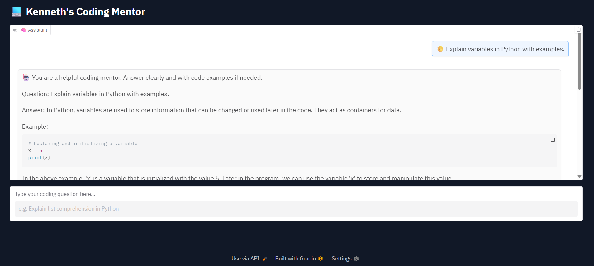

with open("README.md", "w") as f:
    f.write("""# Phi-2 Coding Mentor

A ChatGPT-style coding assistant built using [Phi-2](https://huggingface.co/microsoft/phi-2), Transformers, and Gradio — running entirely in Google Colab.

It answers coding questions in real-time with code examples, explanations, and a beautiful dark-themed UI. Perfect for students, developers, and tech learners.

---

## Features

- Real-time, interactive chatbot
- Sleek, dark-themed UI with chat history
- Powered by Microsoft's Phi-2 LLM (2.7B parameters)
- Explains Python logic with clear examples
- Runs locally in Colab — **no OpenAI API needed**

---

## Preview

  

---

##  How to Use It

###  Step 1: Open in Google Colab

Click this badge to open the notebook in Colab:  

###  Step 2: Run All Cells

The notebook will:
- Install dependencies (`transformers`, `gradio`, etc.)
- Load the Phi-2 model from Hugging Face
- Launch a Gradio chat UI

###  Step 3: Ask Anything!

Try prompts like:
Explain variables in Python.
What is a list comprehension?
Write a Python program to check for prime numbers.

---

##  Tech Stack

-  [Phi-2 by Microsoft](https://huggingface.co/microsoft/phi-2)
-  Hugging Face Transformers
-  PyTorch (GPU on Colab)
- Gradio for UI
- Google Colab for execution

---

##  File Structure
phi2_coding_mentor.ipynb # Colab Notebook with full chatbot code
ui_preview.png # Screenshot of the chatbot UI
README.md # Project description

---

##  Author

Made  by [@codedbykenneth](https://github.com/codedbykenneth)

---

##  License

This project is licensed under the [MIT License](https://opensource.org/licenses/MIT) — you're free to use, modify, and share it!

---

##  If you like this project...

Give it a ⭐ on GitHub and share it with your friends.  
It helps more developers discover helpful, free tools like this!
""")

